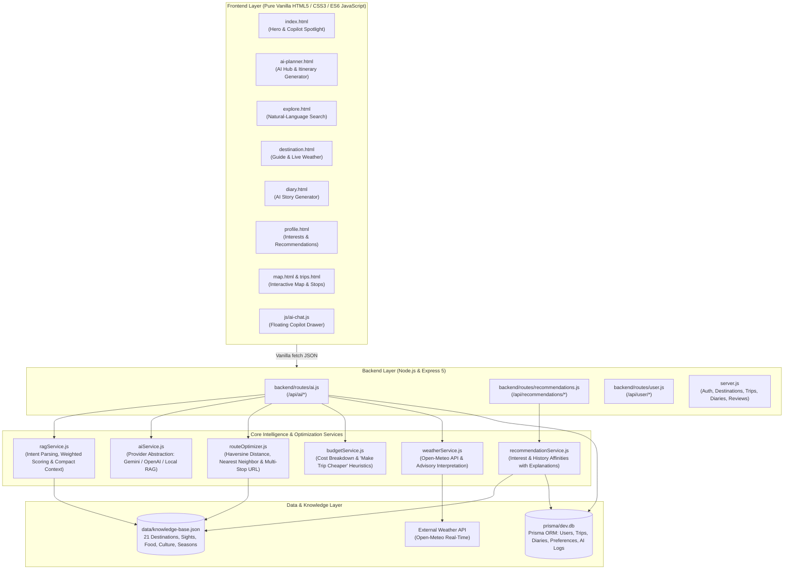

# Karnataka Travel Diaries — AI Travel Copilot Platform

> **Karnataka Travel Diaries is a full-stack AI-powered travel platform for discovering and planning journeys across Karnataka. It combines a retrieval-grounded AI travel assistant, intelligent itinerary generation, natural-language destination search, personalized recommendations, route planning, Google Maps navigation and AI-assisted travel journaling.**

---

## 🌟 The 6-Stage Travel Workflow

```
  DISCOVER   ──▶   PLAN   ──▶   OPTIMIZE   ──▶   NAVIGATE   ──▶   EXPERIENCE   ──▶   REMEMBER
  (Catalog &      (AI Trip      (Heuristic      (Turn-by-turn     (Live Sights,    (AI-Assisted
   NL Search)     Copilot)      Route & Cost)    Google Maps)     Weather Tips)     Diary & Log)
```

---

## 🏛️ System Architecture



---

## 🛠️ Technology Stack & Constraints

- **Frontend:** Pure **HTML5**, **Vanilla CSS3**, and **Vanilla JavaScript (ES6+)**.
  - **Zero** React, Next.js, Vue, Angular, Svelte, TypeScript, TSX, JSX, or Tailwind CSS.
  - All communication uses standard asynchronous `fetch()` calls.
  - Client-side code **never** has access to AI API keys.
- **Backend:** **Node.js** with **Express 5**, **Prisma ORM 6**, and **SQLite**.
- **Interactive Maps:** **Leaflet** with OpenStreetMap tiles.
- **GPS Navigation:** HTML5 Geolocation API with live Google Maps routing (`google.com/maps/dir/...`).
- **Weather:** Real-time meteorological data via **Open-Meteo API**.
- **AI Abstraction:** Unified multi-model adapter supporting **Google Gemini 2.0/1.5 Flash**, **OpenAI GPT-4o-mini**, and an embedded, zero-dependency **Local Grounded RAG Engine**.

---

## ⚡ Key AI Features Implemented

### 1. 🤖 Karnataka AI Travel Assistant (Floating Copilot)
- **Universal Access:** Present across all pages via the floating `✨ Ask Karnataka AI` button (bottom-right on desktop, elevated above mobile navigation bar on handhelds).
- **RAG-Grounded Intelligence:** Analyzes user intent, queries `data/knowledge-base.json`, retrieves matching destination contexts, and generates structured cards with estimated costs, days, day-by-day routes, and direct action buttons (`[View Directions]`, `[Plan Trip]`).
- **Safe Fallbacks:** Built-in starter prompts ("Plan a 3-day Coorg trip", "Where can I go from Bengaluru for 2 days?", "Suggest peaceful hill stations").

### 2. 🗺️ AI Trip Planner (`ai-planner.html`)
- **Configurable Form:** Starting location, duration (days), budget, travelers (Solo/Couple/Friends/Family), transport mode (Car/Bike/Bus/Train), travel pace (Relaxed/Balanced/Packed), and 10 visual interest tags.
- **Progressive Feedback:** Real-time stepped animation messages (*"✨ Understanding your preferences..."* → *"📍 Finding Karnataka destinations..."* → *"🗺️ Building your route..."* → *"💰 Estimating your budget..."* → *"✨ Creating your itinerary..."*).
- **Interactive Itinerary Timeline:** Day-by-day morning/afternoon/evening schedules with destination photography, direct Google Maps navigation buttons, and 1-click **Save This Trip** into the user's permanent trips collection.

### 3. 🔍 AI Natural-Language Destination Search (`explore.html`)
- **Dual Search System:**
  - **Standard Search:** Instant keyword and district matching for simple queries (`Coorg`, `Hampi`, `Gokarna`) without consuming AI tokens.
  - **Natural Language Parsing:** Automatically activates when queries contain multi-constraint criteria (e.g., *"peaceful hill station within 300 km of Bengaluru"*, *"places for photography under ₹5000"*).
- Extracts origin, maximum distance, budget limits, duration, and categories, returning destinations labeled with AI match percentage badges.

### 4. 📚 RAG-Based Karnataka Knowledge Base (`data/knowledge-base.json`)
- Structured records covering all 21 Karnataka destinations in the platform:
  - Districts, categories, GPS coordinates, ideal duration, and best visiting seasons.
  - Verified local attractions, top activities, authentic food specialties, cultural highlights, and practical travel tips.
  - Daily cost estimations and pre-curated trip templates.
- **Strict Grounding:** AI queries receive strictly relevant retrieved snippets rather than dumping entire databases, eliminating hallucinations.

### 5. 🎯 Personalized Recommendations (`profile.html` & `ai-planner.html`)
- **Explicit User Preferences:** Interactive travel interest checklist stored in SQLite (`UserPreference` entity).
- **Multi-Factor Scoring Engine (`recommendationService.js`):** Computes recommendation scores based on selected interests (50%), favorited destinations (25%), past trip history (15%), and category affinity (10%).
- **Explainable Reasons:** Every recommendation displays a human-readable justification (e.g., *"Recommended because you saved Coorg and frequently explore nature and hill destinations."*).
- **Visual "Find My Place" Wizard:** 4-step interactive wizard matching ideal destinations in seconds.

### 6. ✍️ AI Travel Diary Generator (`diary.html`)
- Upgrades the travel journal with a modal **"✨ Write with AI"** flow.
- Users input destination, dates, short notes, highlights, and mood.
- Generates editable travel narratives across 6 tones: **Detailed Journal, Short & Punchy, Storytelling, Casual, Travel Blog, and Photo Caption**.
- Includes revision buttons: `[Make Shorter]`, `[Make More Personal]`, `[Regenerate]`, and `[Use This Story]`. Generated text is never auto-published without user review.

### 7. 🧮 Route & Budget Optimization
- **Route Optimizer (`routeOptimizer.js`):** Computes pairwise Haversine distances with a 1.25x Western Ghats winding factor. Reorders multi-destination itineraries using a nearest-neighbor heuristic and builds multi-stop Google Maps waypoint URLs.
- **Budget Breakdown (`budgetService.js`):** Separates costs into Transportation, Accommodation, Food, Activities, Entry Fees, and Miscellaneous. Includes a **[Make Trip Cheaper]** optimizer that re-tunes stay categories and activities to fit tighter budgets. All figures are prominently labeled: *"Estimated costs — actual prices may vary."*
- **Live Weather Integration (`weatherService.js`):** Fetches real-time temperature, wind speed, and weather codes from Open-Meteo API. Strictly separates factual meteorological data from AI travel advisory tips.
- **Packing Assistant (`packing.js`):** Generates activity- and season-specific checklists with interactive checkboxes and local storage persistence.

---

## 🗄️ Database Entities (Prisma & SQLite)

The schema (`prisma/schema.prisma`) extends the existing user and trip database with structured AI support entities:

| Model | Purpose |
|---|---|
| `User` | Core traveler account credentials and profile |
| `UserPreference` | Explicit travel interests (`isNature`, `isHeritage`, `preferredPace`, etc.) |
| `Destination` | 21 canonical Karnataka destinations with coordinates and media |
| `Attraction` | Sights and landmarks associated with destinations |
| `Trip` & `TripStop` | Custom itineraries created by users or generated by the AI |
| `GeneratedItinerary` | Persistent cache of AI itineraries with budget and route details |
| `DiaryEntry` & `DiaryDraft` | User travel journals and saved AI draft stories |
| `PackingList` | Checklists generated by the packing assistant |
| `AIConversation` & `AIMessage` | Grounded chat history for the floating copilot |

---

## 🔐 Environment Variables & Security

Create a `.env` file in the project root (see `.env.example`):

```env
# Database URL
DATABASE_URL="file:./dev.db"

# Server Port
PORT=3000

# JWT Secret for Session Auth (Generate via: openssl rand -base64 32)
JWT_SECRET="your_production_jwt_signing_secret_min_32_characters_here"

# Base URL
NEXT_PUBLIC_APP_URL="http://localhost:3000"

# Demo Account Login (Set to "false" in production)
ENABLE_DEMO_LOGIN="false"

# Database Seeder Password (Used during 'npm run db:seed')
SEED_DEFAULT_PASSWORD="your_secure_seed_password_here"

# Optional Cloud AI API Keys (Local Grounded RAG works out of the box!)
GEMINI_API_KEY=""
OPENAI_API_KEY=""
AI_API_KEY=""
```

> [!WARNING]
> ### 🚨 Secret Rotation & Git History Warning
> **If any secret was previously hardcoded or committed, that old value remains permanently visible in Git history!**
> - **Rotate All Secrets Immediately:** Before deploying to production, generate a brand-new random `JWT_SECRET`, change all database passwords, update user passwords, and rotate any third-party API keys (`GEMINI_API_KEY`, `OPENAI_API_KEY`).
> - **Git History Purge:** Any string committed in previous commits can be retrieved from git history (`git log`, `git show`). If this repository is ever made public, use tools like `git filter-repo` or BFG Repo-Cleaner to completely purge past commit records.

> [!IMPORTANT]
> **API Key & Secret Safety Guardrails:**
> - Neither `GEMINI_API_KEY` nor `OPENAI_API_KEY` is ever transmitted to or referenced in client-side code.
> - Google Gemini API keys are transmitted in HTTP request headers (`x-goog-api-key`) rather than URL query parameters to prevent exposure in web proxy or server access logs.
> - `.env` is strictly listed in `.gitignore` to prevent secret leaks.
> - Demo accounts can be disabled entirely in production by setting `ENABLE_DEMO_LOGIN="false"`.
> - If no cloud API key is supplied, the platform automatically runs in **LOCAL GROUNDED RAG MODE**, providing full deterministic grounding, route optimization, budgets, and natural language search using the verified Karnataka knowledge base without failing or crashing.

---

## 🚀 Installation & Local Execution

### 1. Clone & Install Dependencies
```bash
cd ~/Downloads/KarnatakaTravelDiaries
npm install
```

### 2. Initialize Database & Knowledge Base
```bash
# Push schema changes to SQLite
npx prisma db push

# Generate Prisma client
npx prisma generate

# Seed sample data (if starting fresh)
node scripts/seed.mjs
```

### 3. Start the Server
```bash
npm start
# Server starts on http://localhost:3000
```

---

## 🧪 Testing Each Feature

| Feature | Where to Test | How to Verify |
|---|---|---|
| **AI Travel Copilot** | Any page (bottom-right button) | Click `✨ Ask Karnataka AI`, try suggested prompts like *"Plan a 3-day Coorg trip"*. Verify structured trip card response with budget and navigation links. |
| **AI Trip Planner** | `ai-planner.html` | Fill in Bengaluru, 3 days, ₹7000, 3 Friends, Car, select Nature & Waterfalls. Click `✨ Generate My AI Trip`. Observe loading steps, vertical timeline, route summary, and budget breakdown. |
| **Make Trip Cheaper** | `ai-planner.html` (under budget table) | Click `💰 Make Trip Cheaper`. Verify reduced stay/activity estimates and travel tips. |
| **Natural Language Search** | `explore.html` | Type: *"peaceful hill station within 300 km of Bengaluru"*. Verify AI extracts filters and displays matched cards with match percentage badges. |
| **Live Weather & AI Note** | `destination.html?id=chikmagalur` | Look at the sidebar widget. Verify real-time Open-Meteo temperature and distinct AI travel note. |
| **AI Travel Diary** | `diary.html` | Click `✨ Write with AI`. Enter destination (e.g. Hampi), mood, and bullet notes. Select style *"Storytelling"*, click `Generate Story`. Test `[Make Shorter]` and `[Use This Story]`. |
| **Personalized Recommendations** | `profile.html` | Check/uncheck travel interests (e.g. Mountains, Photography). Click `Save Travel Interests`. Observe updated recommendations with explainable reasons. |
| **Find My Place Wizard** | `ai-planner.html` (bottom section) | Choose Experience: *Heritage*, Duration: *2-3 Days*, Travelers: *Family*. Click `✨ Find My Karnataka Destination`. |
| **Packing Assistant** | `ai-planner.html` (tab 3) | Enter Kudremukh, 3 days, Monsoon season, Trekking. Click `Generate Packing List`. Check items and click `Save Packing List`. |

---

## 📄 License & Attribution

- Built exclusively for **Karnataka Tourism Exploration**.
- Destination photography: Local assets under `images/destinations/`.
- Maps and Geolocation: OpenStreetMap, Leaflet, and Google Maps Navigation URLs.
