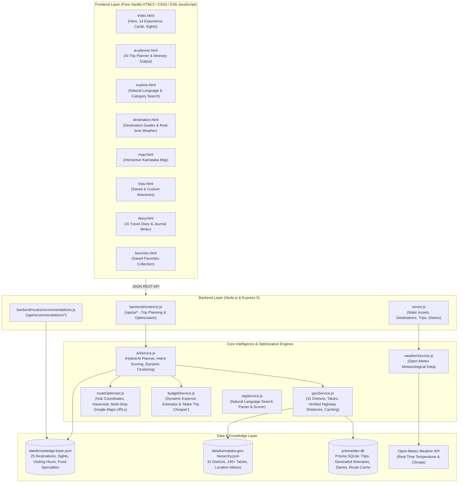

# Karnataka Travel Diaries — "Explore the Soul of Karnataka" 🌸

> **Karnataka Travel Diaries is a full-stack, AI-powered travel platform for discovering, exploring, and planning journeys across Karnataka. It features an intelligent, distance-aware AI Trip Planner, natural-language search, 25 curated destination guides with live weather, interactive mapping, turn-by-turn Google Maps navigation, an AI travel diary writer, and anonymous local favorites.**

---

## 🌟 Overview & Core Principles

- **Pure Vanilla Web Architecture**: Built using pure HTML5, modern vanilla CSS3, and modern vanilla JavaScript (ES6+). Zero heavy frameworks (no React, Next.js, Vue, Angular, TypeScript, or Tailwind).
- **Frictionless & Anonymous**: Completely free of authentication, logins, passwords, or paywalls. All features (AI Trip Planner, Trips, Travel Diary, and ❤️ Favorites) are instantly accessible to any traveler.
- **Hybrid AI + Deterministic Geographic Engine**: Combines the reasoning and narrative capabilities of Large Language Models (Google Gemini & OpenAI with a robust Local Rule Engine fallback) with deterministic geographic calculations (verified road distances, ghat winding factors, taluk hierarchies, and opening hours).
- **Distance & Direction Coherence**: Minimizes backtracking, respects daily driving limits, clusters short trips, and dynamically constructs multi-region circuits for longer journeys.

---

## 🏛️ System Architecture



---

## ⚡ The Intelligent AI Trip Planner (`ai-planner.html`)

The AI Trip Planner functions as a **real, distance-aware travel planner** rather than a static place filter:

### 1. Travel Type as Intent, Not a Rigid List
The planner interprets user themes as travel intent:
- **Coastal & Beach Escapes**: Prioritizes Karnataka’s 320 km Arabian Sea coastline while blending legendary cultural sights (e.g. Malpe Beach, St. Mary's Island, Kaup Lighthouse, Udupi Sri Krishna Matha, and authentic Karavali seafood).
- **Nature & Waterfalls**: Identifies Western Ghats nature corridors (Chikkamagaluru, Sakleshpur, Coorg, Kudremukh, Jog Falls).
- **History & Heritage**: Prioritizes UNESCO Vijayanagara ruins (Hampi), Chalukyan cave temples (Badami & Pattadakal), and Hoysala/Wodeyar legacies (Belur-Halebidu, Mysuru).
- **Spiritual Karnataka**: Connects sacred temple corridors (Dharmasthala, Kukke Subrahmanya, Udupi, Murudeshwar, Gokarna, Sringeri).
- **Hill Station Getaways**: High-altitude mist retreats (Chikkamagaluru, Coorg, Sakleshpur).
- **Wildlife & Adventure**: River rafting in Dandeli, safaris in Bandipur and Nagarhole.
- **Culture & Food**: Authentic culinary walking trails and palace heritage.

### 2. Multi-Region Karnataka Journeys (7+ Days)
When a traveler selects **7+ Days** (7, 8, 9, 10, 11, 12+ days), the planner avoids stretching 2 places across a week. It dynamically constructs a **3- to 4-region connected journey**:
- **7-Day Nature Circuit**: Chikkamagaluru (Days 1–2) → Sakleshpur & Kudremukh (Days 3–4) → Coorg (Days 5–6) → Return to Bengaluru (Day 7).
- **7-Day Coastal Odyssey**: South Karavali / Mangaluru & Udupi (Days 1–2) → Central Coast / Murudeshwar & Honnavar (Days 3–4) → North Coast / Gokarna & Karwar (Days 5–6) → Return to Bengaluru (Day 7).
- **7-Day Heritage Journey**: Vijayanagara / Hampi (Days 1–2) → Badami & Pattadakal (Days 3–4) → Hoysala / Belur-Halebidu & Mysuru (Days 5–6) → Return to Bengaluru (Day 7).

### 3. Intelligent Clustered Short Trips (1–3 Days)
- **1 Day**: Bounded within 150 km of origin (e.g. Bengaluru → Nandi Hills or Lalbagh/Bengaluru Palace; Mangaluru → Panambur & Kadri Manjunatha).
- **2 Days**: Anchored to **one primary regional cluster** closest to the starting location (e.g. Chikkamagaluru cluster from Bengaluru; Kudremukh/Coorg from Mangaluru; Badami from Hubballi), avoiding statewide jumping.
- **3 Days**: Explores one core cluster with neighboring attractions (e.g. Mangaluru + Udupi; Chikkamagaluru + Sakleshpur; Mysuru + Srirangapatna).

### 4. Origin & Destination Sensitivity
- **Starting Location**: Starting in Mangaluru selects Western Ghats nature (Kudremukh/Coorg) instead of distant eastern hills; starting in Mysuru selects Coorg/Bandipur; starting in Hubballi selects Badami/Dandeli.
- **Different Ending Location**: If the user starts in Bengaluru and ends in Mangaluru, the route sequences progressively through intermediate regions (Mysuru → Coorg → Sakleshpur → Udupi → Mangaluru).
- **Round-Trip Mode**: On the final day of a round-trip, the morning features sightseeing, the afternoon has lunch, and the evening schedules the return drive back to the starting hub.

### 5. Attraction Uniqueness & Opening Hours
- Selects distinct morning, afternoon, and evening attractions for every day.
- Prevents repeating attractions when spending consecutive days in the same destination.
- Respects visiting hours (morning peaks/temples, afternoon shaded sights/museums, evening sunset points).
- Embeds authentic destination cuisine (Neer Dosa & Goli Baje in Udupi, Pandi Curry & Akki Rotti in Coorg, Mysore Pak in Mysuru, Jolada Rotti in Badami).

---

## 🔍 Other Core Platform Features

### 1. Natural Language Search (`explore.html`)
- **Dual Engine**: Instant keyword matching for quick queries (`Hampi`, `Gokarna`) and automatic natural-language parsing for multi-criteria phrases (e.g., *"peaceful hill station within 300 km of Bengaluru"*, *"places for photography under ₹5000"*).
- Extracts origin, distance limits, budget, and travel interests, returning matched destination cards with match percentage badges.

### 2. Destination Guides & Live Weather (`destination.html`)
- Comprehensive guides for 25 destinations across Karnataka with high-resolution photography, short overviews, key attractions, visiting hours, and local food highlights.
- Live real-time weather fetched dynamically from Open-Meteo API.

### 3. Interactive Karnataka Map (`map.html`)
- Interactive Leaflet map displaying destinations, districts, and cultural regions across Karnataka.
- Filter destinations by categories (Beaches, Hill Stations, Heritage, Wildlife, Spiritual, Waterfalls).

### 4. Travel Diary with AI Writer (`diary.html`)
- Modal **"✨ Write with AI"** flow for travel journals.
- Transforms bullet points and traveler mood into polished travel narratives across 6 tones (Storytelling, Detailed Journal, Casual, Travel Blog, Photo Caption, Short & Punchy).

### 5. Turn-by-Turn Google Maps Navigation
- Generates verified, multi-stop Google Maps driving directions URLs (`google.com/maps/dir/...`) for every generated trip.

### 6. Anonymous Favorites & Custom Trips (`favorites.html`, `trips.html`)
- Heart any destination across the app to save it into ❤️ Favorites.
- Save AI-generated itineraries or create custom road trips with 1 click.

---

## 🛠️ Technology Stack

| Layer | Technologies Used |
|---|---|
| **Frontend** | Pure HTML5, Vanilla CSS3, Vanilla ES6+ JavaScript |
| **Backend** | Node.js, Express 5 |
| **Database** | SQLite, Prisma ORM 6 |
| **Geographic Services** | Custom Geocoding, Haversine Engine, 31 Districts & 240+ Taluks Hierarchy |
| **Maps & Weather** | Leaflet / OpenStreetMap (map.html), Open-Meteo Meteorological API |
| **AI Integration** | Google Gemini 2.0 / 1.5, OpenAI GPT-4o-mini, Local Grounded Engine |

---

## 📁 Repository Structure

```
KarnatakaTravelDiaries/
├── ai-planner.html            # AI Trip Planner page
├── index.html                 # Home page with 14 experience cards & trending destinations
├── explore.html               # Search & filter destinations
├── destination.html           # Individual destination guide & real-time weather
├── map.html                   # Interactive Leaflet map of Karnataka
├── trips.html                 # Custom & saved trips page
├── diary.html                 # Travel Diary & AI writing assistant
├── favorites.html             # Saved favorites collection
├── server.js                  # Main Express application server
├── backend/
│   ├── routes/
│   │   ├── ai.js              # AI Planner endpoints (/api/ai/plan-trip, /api/ai/optimize-trip)
│   │   └── recommendations.js # Destination recommendation endpoints
│   └── services/
│       ├── aiService.js       # Hybrid AI Planning Engine, Intent Scoring & Multi-Region Circuits
│       ├── geoService.js      # Geographic Hierarchy, Verified Highway Distances & Caching
│       ├── routeOptimizer.js  # Hub coordinates, Haversine distance & Google Maps routing
│       ├── budgetService.js   # Dynamic budget calculator & optimizer
│       ├── ragService.js      # Natural language search parser & knowledge retrieval
│       └── weatherService.js  # Open-Meteo API weather integration
├── css/
│   ├── ai.css                 # AI Trip Planner styling
│   ├── style.css              # Core Karnataka design system & navigation styling
│   └── destination.css        # Destination guide styles
├── js/
│   ├── ai-planner.js          # AI Trip Planner frontend controller
│   ├── app.js                 # Global utilities & navigation
│   ├── diary.js               # Travel Diary controller
│   ├── favorites.js           # Favorites controller
│   └── trips.js               # Trips management controller
├── data/
│   ├── knowledge-base.json    # Canonical database of 25 Karnataka destinations & attractions
│   └── karnataka-geo-hierarchy.json # Complete hierarchy of 31 districts & 240+ taluks
├── scripts/
│   ├── testAllPlannerCases.mjs       # Standard verification test suite (8 tests)
│   ├── testNewIntelligentFeatures.mjs # Deep intelligence & multi-region verification suite (8 scenarios)
│   └── generateSitemap.mjs    # Dynamic SEO sitemap generator
└── prisma/
    └── schema.prisma          # Database schema (Trips, Itineraries, Diaries, RouteCache)
```

---

## 🚀 Installation & Local Execution

### 1. Clone & Install Dependencies
```bash
cd ~/Downloads/KarnatakaTravelDiaries
npm install
```

### 2. Configure Environment (Optional)
Create a `.env` file in the root directory (see `.env.example`):
```env
PORT=3000
DATABASE_URL="file:./dev.db"

# Optional Cloud AI API Keys (Local Grounded Engine works out of the box!)
GEMINI_API_KEY=""
OPENAI_API_KEY=""
```

### 3. Initialize Database & Generate Prisma Client
```bash
npx prisma db push
npx prisma generate
```

### 4. Build & Start the Server
```bash
npm run build
npm start
```
The application will be live at **`http://localhost:3000`**.

---

## 🧪 Automated Testing & Verification

The project includes two comprehensive test suites:

### 1. Standard Verification Suite
Validates core requirements and duration bounds:
```bash
node scripts/testAllPlannerCases.mjs
```
- ✅ Test 1: 2 Days | Start: Bengaluru | Type: Temple & Spiritual (< 400 km, Mysuru/Srirangapatna)
- ✅ Test 2: 2 Days | Start: Bengaluru | Type: Beaches (Single coastal base)
- ✅ Test 3: 3 Days | Start: Bengaluru | Type: Beaches (Mangaluru + Udupi connected)
- ✅ Test 4: 3 Days | Start: Bengaluru | Type: Temple & Spiritual (< 500 km)
- ✅ Test 5: 4 Days | Start: Bengaluru | Type: Nature & Waterfalls (Connected Western Ghats)
- ✅ Test 6: 6 Days | Start: Bengaluru | Type: Temple & Spiritual (Coastal Spiritual Circuit)
- ✅ Test 7: 6 Days | Start: Bengaluru | Type: Beaches (6-day Grand Karavali Circuit)
- ✅ Test 8: 6 Days | Start: Mysuru | Type: Temple & Spiritual (Distance to Dharmasthala 235 km)

### 2. Deep Intelligence & Multi-Region Suite
Validates dynamic candidate selection, 7+ days multi-region loops, origin sensitivity, and attraction blending:
```bash
node scripts/testNewIntelligentFeatures.mjs
```
- ✅ Scenario 1: 1-Day Nature Trip (Nandi Hills, 56 km within 150 km bound)
- ✅ Scenario 2: 2-Day Nature Trip (Chikkamagaluru cluster, Mullayanagiri, Jhari/Hebbe Falls, return to Bengaluru)
- ✅ Scenario 3: 2-Day Nature Trip from Mangaluru (Kudremukh, 138 km, origin-sensitive)
- ✅ Scenario 4: 7-Day Multi-Region Nature Journey (Chikkamagaluru → Sakleshpur → Kudremukh → Sringeri → Coorg → return)
- ✅ Scenario 5: 7-Day Multi-Region Coastal Trip (Mangaluru → Udupi → Murudeshwar → Honnavar → Gokarna → Karwar → return)
- ✅ Scenario 6: 7-Day Multi-Region Heritage Trip (Hampi → Badami → Pattadakal → Belur → Mysuru → return)
- ✅ Scenario 7: 7-Day Trip with Different Ending Location (Bengaluru → Mysuru → Coorg → Sakleshpur → Udupi → Mangaluru)
- ✅ Scenario 8: Attraction Uniqueness & Theme Blending (No duplicate attractions across days; temples and local food blended into beach trips)

---

## 📄 License & Attribution

- Built exclusively for **Karnataka Tourism Exploration**.
- Destination photography: Local assets under `images/destinations/`.
- Maps and Geolocation: OpenStreetMap, Leaflet, and Google Maps Navigation URLs.
